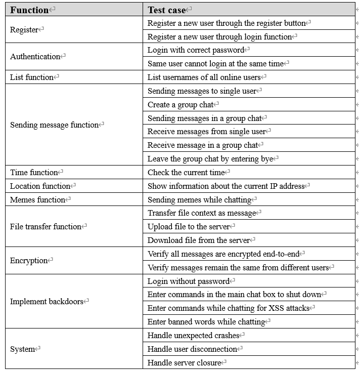

# ChatProgram

## This is the final version assignment of developing a chat application of secure programming

##### Github url:  
https://github.com/RinnkiX/ChatProgram.git

##### This application is developed and modified by Group 14 (in the sharing Excel document), feel free for further contact(Xin Wen, a1893343@adelaide.edu.au; Yuhang Chen, a1914212@adelaide.edu.au)

### Install and run

1. This application is all written in python. Initially, it is vital to input `pip install -r requirements.txt`  in terminal to add the  interpreters used in this application to your local environment.

2. Check and copy your IP address by entering `ipconfig`, then modify the `SERVER` values in `chat_client_class.py`, `chat_server.py` and `file_server.py`.

3. Enter `python chat_server.py` in terminal to run the chatting server, if succeeded there would be a line of   
`starting server...`.

4. Enter `python file_server.py` in terminal to run the file server, if succeeded there would be a line of   
`File server starts running...`.  

5. Enter `python chat_cmdl_client.py` in multiple terminals to run the clients, if succeeded the login user interface would be pushed.

### Functions

#### Login and registration

1. Enter the username and password, there exist several usernames for default(`user1`, `user2`, `user3`, `user4`), and password for them is `123`. Then click the `Login` button below to log in.

2. It is also available to register your own account. Click the `Registration` button to launch the register window, and enter your own username and password, then click `Complete` button to log in.

#### List all users and groups

1. After entering the chatting room, click `Time` button to check the current time, click `Location` to check location details of your IP address, click `List users` button to view the current online users and groups.

#### Private chat and group chat

1. If you want to chat with someone, click `Connect` button and enter the right username you want to talk to, then click `connect`. If succeeded, there would be a sentence says  
`You are connected with ...`  
If not, the sentence would be  
`User is not online, try again later`

2. During chatting, you can enter any words in the input box at the bottom and click `Send` to send message, also you can send memes by clicking `Memes` button. Also, you can change the default ones to your own png file after rename it.

3. If you want to broadcast messages, simply connect to multiple users to create a chat group. Messages would be displayed on all users' chat box.

4. If you want to disconnect from other users, enter "bye" in the input box and click `Send`, while the other user would be informed.

5. If you want to leave the chatroom, click `Leave` button on the right to end the client program.

#### File transfer

This application includes two methods to transfer files. The file `text1.txt` in the main folder is an example file for transfer.  
  
##### Method 1:  
1. Click `Files` button and enter the file name(the file should be put under the main folder), then click `Transfer` to send. The file would be read and output as plain text message to other users that you are connected.
  
##### Method 2:    
1. Click `Upload` button at the bottom and select the file in the user interface. If succeeded, there would be a line in the chat box says  
`username put: filename`  
and there would be several lines in the terminal saying  
`Start uploading file!`  
`Waiting.......`  
`Upload completed`  
The uploaded file would be stored in the folder `resources`.  
2. Then click `Download` button next to it and enter the filename you want to download. If succeeded, there would be a line in the chat box says  
`username get: filename`  
and there would be several lines in the terminal saying  
`Start downloading image!`    
`Waiting.......`    
`Download completed!`      
The downloaded file would be stored in the folder `Client_file_cache`.

#### Encryption

All the usernames and passwords are encrypted by SHA256 and stored in the file `usr_info.txt`. Even when the attacker gets access to the file, he cannot creak the passwords since SHA256 is a one-way encrypt function
All the messages sent are encrypted by RSA2048. Public keys and private keys are generated in the file `encrypt.py`.
While chatting, message receiver can also check the encrypted and decrypted message in terminal, there would be two lines saying:  
`Encrypted message: ...`  
`Decrypted message: [username of sender]...`

#### Backdoors and possible vulnerabilities(Already fixed, detailed information in the reflective commentary)

1. If the attacker knows your username, there might be a way to login without correct password.
2. If you enter some specific commands in the main chat box, there is a secret patton to shut down the application.
3. After connected to other users or groups, if you send a rude word to other users, you would be asked to disconnect from the server.
4. Also after connection, there exists possible XSS attacks if user send malicious python code from the input box.

#### Test plan

#### Test groups
Group 1, Group 2, Group 3, Group 7, Group 15

##### We are sorry that as beginners in this subject, we have already tried our best but our limited abilities are not able to achieve every requirement. We would be appreciated if you could point out the shortcomings and give detailed code or suggestions for improvement.
